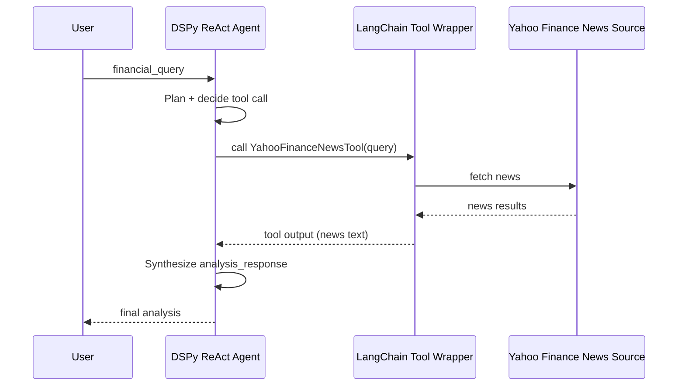
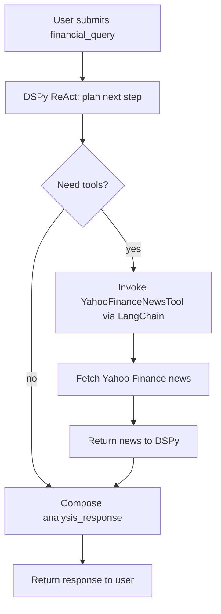

Financial Analysis with DSPy ReAct and Yahoo Finance News¶

This tutorial shows how to build a financial analysis agent using DSPy ReAct with LangChain's Yahoo Finance News tool for real-time market analysis.

# What You'll Build¶
A financial agent that fetches news, analyzes sentiment, and provides investment insights.

See `outputs.md` for formatted demo results plus a concise DSPy benefits section.

# Architecture

## Sequence Diagram


## Activity Diagram


## Components
| Component | Input | Handling Process | Output |
|---|---|---|---|
| DSPy ReAct Agent | `financial_query` + tool results | Plans next step, selects tools, integrates observations, and composes response. | `analysis_response` |
| LangChain Tool Wrapper | Tool call request (query string) | Validates request, calls YahooFinanceNewsTool, normalizes result for DSPy. | News text payload |
| Yahoo Finance News Source | Query (ticker/topic) | Retrieves latest news items from Yahoo Finance. | Raw news results |

# Why DSPy Here (With Examples)

## 1) Structured inputs/outputs (signatures + modules)
Define what goes in and what comes out, instead of ad-hoc prompts.

Example data shape:
```python
input_data = {"financial_query": "Compare AAPL and MSFT performance"}
output_data = {"analysis_response": "AAPL leads YTD; MSFT shows steadier long-term growth..."}
```

## 2) Built-in ReAct loop + tool orchestration
DSPy manages the think -> call tool -> observe -> answer cycle.

Example tool calls:
```
Tool: get_stock_price("AAPL") -> {"ticker":"AAPL","price":271.86,"change_percent":-0.43}
Tool: get_stock_price("MSFT") -> {"ticker":"MSFT","price":483.62,"change_percent":-0.8}
Tool: YahooFinanceNewsTool("AAPL") -> "Vision Pro demand softness..."
Final: Combined analysis using price + news signals.
```

## 3) Reusable components (modules you can compose + test)
Build a module once, reuse it in multiple flows.

Example reuse:
```python
class FinancialAnalysisAgent(dspy.Module):
    ...

class RiskSummary(dspy.Module):
    # Same tools, different output focus.
    ...
```

## 4) Evaluation + optimization (teleprompting + metrics)
Score outputs and improve prompts systematically.

Example eval set:
```python
train = [
    {"financial_query": "AAPL outlook", "analysis_response": "Mentions AI + Vision Pro risks"},
    {"financial_query": "TSLA sentiment", "analysis_response": "Mixed/neutral stance"},
]
metric = "SemanticF1"
```

## 5) Adapter system for multiple LLM providers
Switch providers without rewriting agent logic.

Example swap:
```python
lm = dspy.LM(model="perplexity/sonar")
# later:
lm = dspy.LM(model="gpt-4o")
```

# DSPy Concept and Alternatives

## DSPy Concept (Clear Framing)

### Problem Statement
- LLM apps built from ad-hoc prompts are hard to control, hard to parse, and hard to improve systematically.
- Tool-using agents often require brittle glue code and inconsistent output formats.

### Solution Approach
- Treat LLM interactions as programs with explicit input/output contracts.
- Use evaluation data to iteratively improve prompt behavior rather than manual tweaking.

### Technical Solution
- **Signatures** define inputs/outputs (e.g., `financial_query -> analysis_response`).
- **Modules** encapsulate reasoning steps (e.g., ReAct) and are composable.
- **Adapters** format prompts and parse structured outputs across providers.
- **Evaluation/teleprompting** provides measurable feedback to optimize prompts.

### Feasible to Scale
- Reusable modules + signatures allow teams to standardize outputs across many tasks.
- Evaluation pipelines make model behavior measurable as the codebase grows.
- Provider adapters let you scale across models without rewriting logic.

## Open-Source Alternatives (Different Focus Areas)
- **LangChain**: broad tool + agent ecosystem, strong integrations, less structure by default.
- **LangGraph**: stateful graph-based agent workflows for complex orchestration.
- **LlamaIndex**: data-centric pipelines (RAG, indexing, retrieval) with composable components.
- **Haystack**: production-oriented RAG pipelines and evaluation tooling.
- **AutoGen**: multi-agent collaboration and conversation patterns.
- **CrewAI**: role-based multi-agent workflows.
- **Semantic Kernel**: skill/plugin orchestration with planners.

## Quick Selection Guide
- Structure + optimization: DSPy
- Integration breadth + flexibility: LangChain / LangGraph
- Data/RAG focus: LlamaIndex / Haystack
- Multi-agent coordination: AutoGen / CrewAI
- Skill/plugin orchestration: Semantic Kernel

# Who Uses DSPy (And How)

1) Solo architect (VSCode + Codex)  
Leverages DSPy to define clear signatures per feature, reuse ReAct + tool wiring without hand-rolled glue, and add small evaluation sets before shipping.

2) ML engineer prototyping pipelines  
Uses signatures/modules to iterate quickly, teleprompting + metrics to optimize quality, and adapters to compare providers without rewrites.

3) Applied AI team standardizing outputs  
Enforces output schemas for downstream parsing, shares reusable modules across teams, and adds evaluation gates in CI.

4) Product team shipping tool-using agents  
Relies on ReAct for robust tool calls, predictable outputs for UI/analytics, and provider adapters to swap models safely.

5) Researcher benchmarking prompt/program optimization  
Formalizes tasks with signatures, measures improvements with metrics, and runs controlled comparisons across LLMs.
